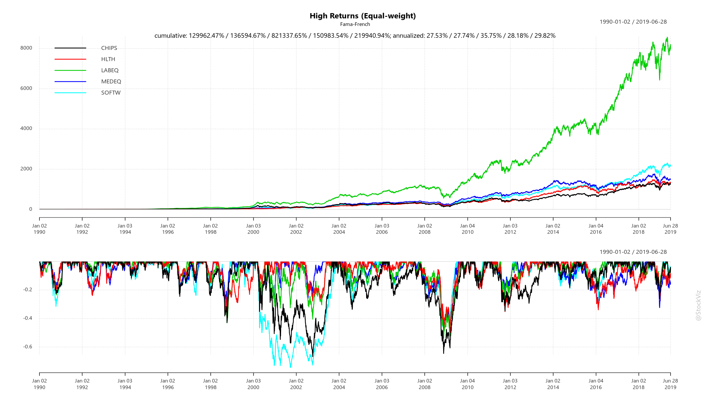
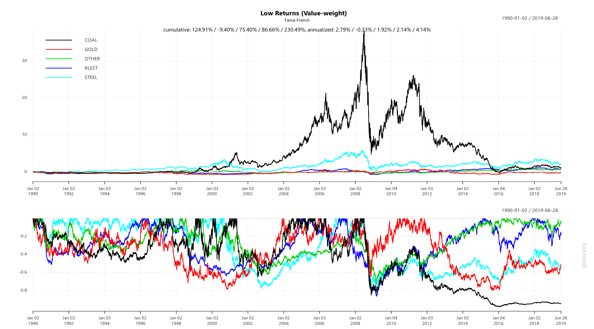
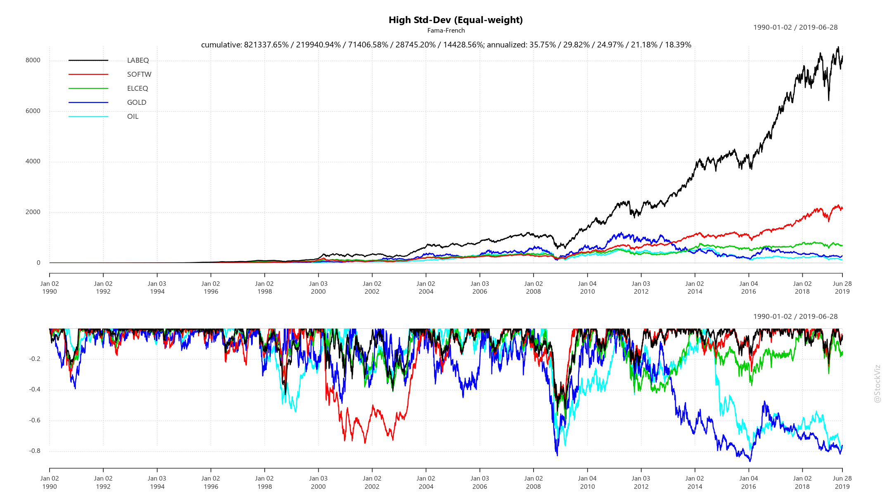
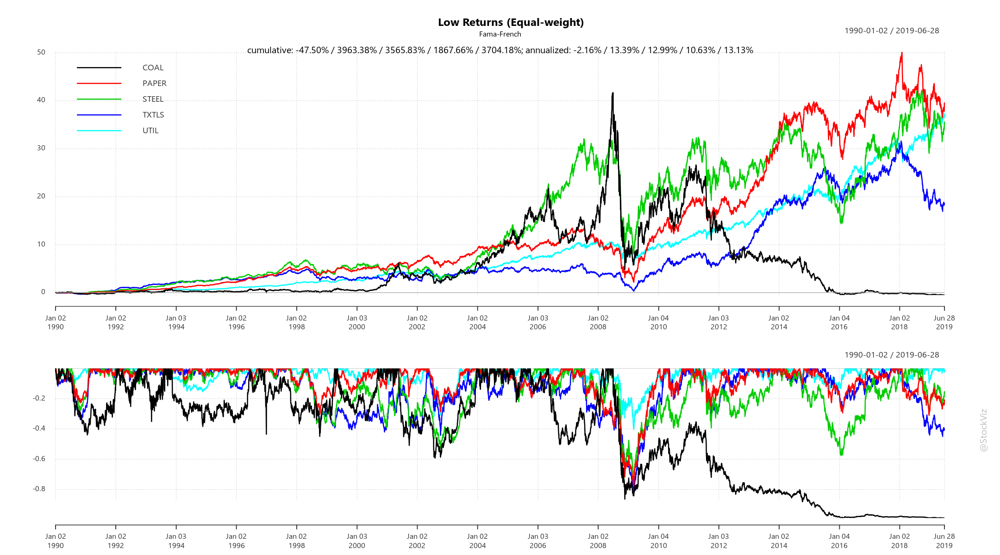

# Exploring industry returns in the Fama-French data-set

The [49 Industry Portfolios](https://mba.tuck.dartmouth.edu/pages/faculty/ken.french/Data_Library/det_49_ind_port.html) data-set has a series of daily returns of 49 different industry types. Here, we look at some of their statistical properties.

The documentation for the Fama-French data-set can be found [here](https://plutopy.readthedocs.io/en/latest/FamaFrench.html) and [here](https://shyams80.github.io/plutoR/docs/reference/FamaFrench-class.html)


```R
library(tidyverse)
library(ggthemes)
library(odbc)
library(plutoR)
library(quantmod)
library(lubridate)
library(reshape2)
library(PerformanceAnalytics)
library(ggrepel)
library(tbl2xts)

options("scipen"=999)
options(stringsAsFactors = FALSE)

source("config.R")
source("goofy/plot.common.R")

#initialize
famaFrench <- FamaFrench()
```

    ── Attaching packages ─────────────────────────────────────── tidyverse 1.2.1 ──
    ✔ ggplot2 3.2.1     ✔ purrr   0.3.2
    ✔ tibble  2.1.3     ✔ dplyr   0.8.3
    ✔ tidyr   0.8.3     ✔ stringr 1.4.0
    ✔ readr   1.3.1     ✔ forcats 0.4.0
    ── Conflicts ────────────────────────────────────────── tidyverse_conflicts() ──
    ✖ dplyr::filter() masks stats::filter()
    ✖ dplyr::lag()    masks stats::lag()
    Loading required package: xts
    Loading required package: zoo
    
    Attaching package: ‘zoo’
    
    The following objects are masked from ‘package:base’:
    
        as.Date, as.Date.numeric
    
    Registered S3 method overwritten by 'xts':
      method     from
      as.zoo.xts zoo 
    
    Attaching package: ‘xts’
    
    The following objects are masked from ‘package:dplyr’:
    
        first, last
    
    Loading required package: TTR
    Registered S3 method overwritten by 'quantmod':
      method            from
      as.zoo.data.frame zoo 
    Version 0.4-0 included new data defaults. See ?getSymbols.
    
    Attaching package: ‘lubridate’
    
    The following object is masked from ‘package:base’:
    
        date
    
    
    Attaching package: ‘reshape2’
    
    The following object is masked from ‘package:tidyr’:
    
        smiths
    
    
    Attaching package: ‘PerformanceAnalytics’
    
    The following object is masked from ‘package:graphics’:
    
        legend
    
    Registering fonts with R


```R
startDt <- as.Date("1990-01-01")

#value (market-cap) weighted
valueWtd <- famaFrench$Industry49Daily() %>%
    filter(RET_TYPE == 'AVWRD' & TIME_STAMP >= startDt) %>%
    mutate(R = RET/100) %>%
    select(DATE = TIME_STAMP, KEY_ID, R) %>%
    collect() %>% 
    # the KEY_ID column has industry id's
    # we want them as column names
    mutate(group=1) %>%
    spread(KEY_ID, R) %>%
    select(-group) %>%
    tbl_xts()

#equal weighted
equalWtd <- famaFrench$Industry49Daily() %>%
    filter(RET_TYPE == 'AEWRD' & TIME_STAMP >= startDt) %>%
    mutate(R = RET/100) %>%
    select(DATE = TIME_STAMP, KEY_ID, R) %>%
    collect() %>% 
    # the KEY_ID column has industry id's
    # we want them as column names
    mutate(group=1) %>%
    spread(KEY_ID, R) %>%
    select(-group) %>%
    tbl_xts()
```


```R
lookbackDays <- 220 * 5

rrValueWtd <- rollapply(valueWtd, lookbackDays, Return.cumulative, by.column = F)
rrEqualWtd <- rollapply(equalWtd, lookbackDays, Return.cumulative, by.column = F)

rrValueWtd <- na.omit(rrValueWtd)
rrEqualWtd <- na.omit(rrEqualWtd)

names(rrValueWtd) <- names(valueWtd)
names(rrEqualWtd) <- names(equalWtd)
```


```R
applyFnDf <- function(dframe, appFn){
    temp <- apply(dframe, 2, appFn)
    temp <- data.frame(temp)
    temp <- cbind(temp, row.names(temp))
    colnames(temp) <- c(as.character(substitute(appFn)), 'I')
    return(temp)
}
```


```R
cumValueWtd <- applyFnDf(valueWtd, Return.cumulative)
cumEqualWtd <- applyFnDf(equalWtd, Return.cumulative)

sdValWtd <- applyFnDf(rrValueWtd, sd)
sdEqlWtd <- applyFnDf(rrEqualWtd, sd)

statsValDf <- sdValWtd %>% inner_join(cumValueWtd)

statsEqlDf <- sdEqlWtd %>% inner_join(cumEqualWtd)
```

    Joining, by = "I"
    Joining, by = "I"


```R
#Value weighted low sd, sorted by returns
valLowSd <- statsValDf %>% 
    top_n(5, wt=-sd) %>%
    arrange(desc(`Return.cumulative`)) %>%
    select(I) %>%
    as.vector()

#Equal weighted low sd, sorted by returns
eqlLowSd <- statsEqlDf %>% 
    top_n(5, wt=-sd) %>%
    arrange(desc(`Return.cumulative`)) %>%
    select(I) %>%
    as.vector()

#Value weighted high returns"
valHighRet <- statsValDf %>% 
    top_n(5, wt=`Return.cumulative`) %>%
    select(I) %>%
    as.vector()

#Equal weighted high returns"
eqlHighRet <- statsEqlDf %>% 
    top_n(5, wt=`Return.cumulative`) %>%
    select(I) %>%
    as.vector()
```


```R
#Value weighted high sd, sorted by returns
valHighSd <- statsValDf %>% 
    top_n(5, wt=sd) %>%
    arrange(desc(`Return.cumulative`)) %>%
    select(I) %>%
    as.vector()

#Equal weighted high sd, sorted by returns
eqlHighSd <- statsEqlDf %>% 
    top_n(5, wt=sd) %>%
    arrange(desc(`Return.cumulative`)) %>%
    select(I) %>%
    as.vector()

#Value weighted low returns"
valLowRet <- statsValDf %>% 
    top_n(5, wt=-`Return.cumulative`) %>%
    select(I) %>%
    as.vector()

#Equal weighted low returns"
eqlLowRet <- statsEqlDf %>% 
    top_n(5, wt=-`Return.cumulative`) %>%
    select(I) %>%
    as.vector()
```


```R
options(repr.plot.width=18, repr.plot.height=10)
```


```R
Common.PlotCumReturns(valueWtd[, valLowSd$I], "Low Std-Dev (Value-weight)", "Fama-French")
```


```R
Common.PlotCumReturns(valueWtd[, valHighRet$I], "High Returns (Value-weight)", "Fama-French")
```


```R
Common.PlotCumReturns(equalWtd[, eqlLowSd$I], "Low Std-Dev (Equal-weight)", "Fama-French")
```


```R
Common.PlotCumReturns(equalWtd[, eqlHighRet$I], "High Returns (Equal-weight)", "Fama-French")
```





```R
Common.PlotCumReturns(valueWtd[, valHighSd$I], "High Std-Dev (Value-weight)", "Fama-French")
```


```R
Common.PlotCumReturns(valueWtd[, valLowRet$I], "Low Returns (Value-weight)", "Fama-French")
```





```R
Common.PlotCumReturns(equalWtd[, eqlHighSd$I], "High Std-Dev (Equal-weight)", "Fama-French")
```





```R
Common.PlotCumReturns(equalWtd[, eqlLowRet$I], "Low Returns (Equal-weight)", "Fama-French")
```





This notebook was created using [pluto](http://pluto.studio). Learn more [here](https://github.com/shyams80/pluto)
