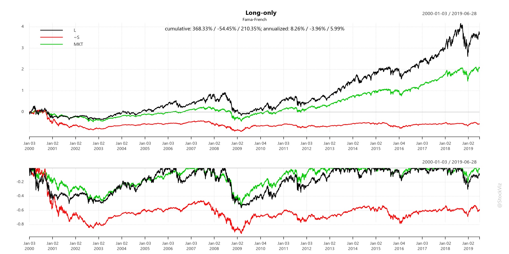
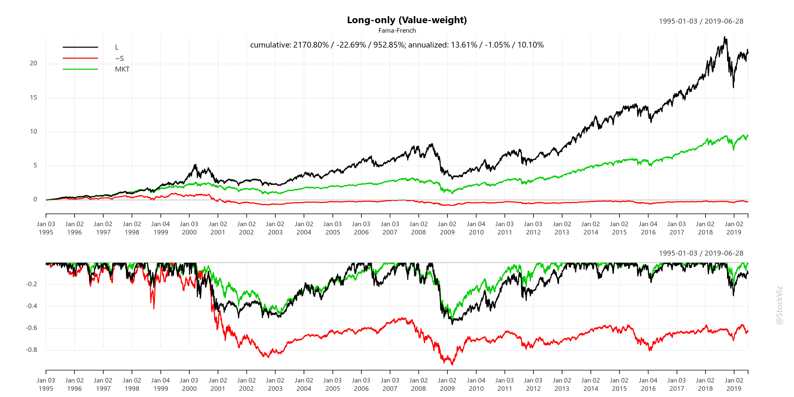
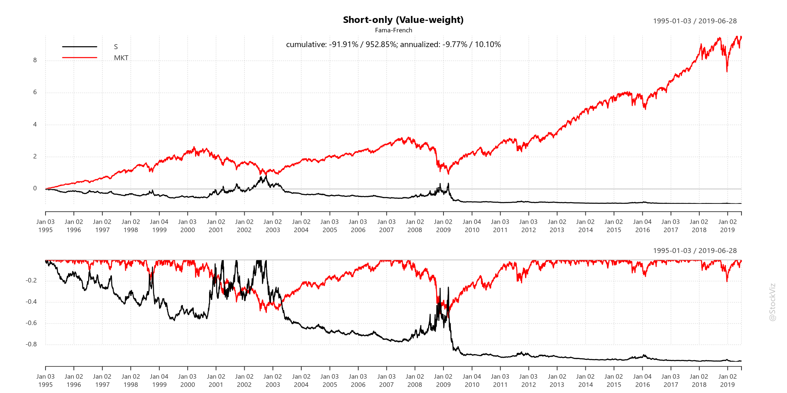

# The Long and Short of Fama-French Momentum

Here, we construct three portfolios out of the Fama-French Momentum data-set -- long-only, short-only and long-short -- to get an idea of how they intersect.

The [Fama-French](https://mba.tuck.dartmouth.edu/pages/faculty/ken.french/Data_Library/det_10_port_form_pr_12_2_daily.html) data-set has returns for portfolios constructed out of each decile of prior returns. With **HI_PRIOR** and **LO_PRIOR** returns, long-only, long-short and short-only portfolio daily returns can be calculated. These returns can then be compared with market returns contained in the [5 Factors (2x3)](https://mba.tuck.dartmouth.edu/pages/faculty/ken.french/Data_Library/f-f_5_factors_2x3.html) data-set by adding back the **Rf** to **Rm-Rf**.

The documentation for the Fama-French data-set can be found [here](https://plutopy.readthedocs.io/en/latest/FamaFrench.html) and [here](https://shyams80.github.io/plutoR/docs/reference/FamaFrench-class.html)


```R
library(tidyverse)
library(ggthemes)
library(odbc)
library(plutoR)
library(quantmod)
library(lubridate)
library(reshape2)
library(PerformanceAnalytics)
library(ggrepel)

options("scipen"=999)
options(stringsAsFactors = FALSE)
options(repr.plot.width=16, repr.plot.height=8)

source("config.R")
source("goofy/plot.common.R")

#initialize
famaFrench <- FamaFrench()
```

    ── Attaching packages ─────────────────────────────────────── tidyverse 1.2.1 ──
    ✔ ggplot2 3.2.1     ✔ purrr   0.3.2
    ✔ tibble  2.1.3     ✔ dplyr   0.8.3
    ✔ tidyr   0.8.3     ✔ stringr 1.4.0
    ✔ readr   1.3.1     ✔ forcats 0.4.0
    ── Conflicts ────────────────────────────────────────── tidyverse_conflicts() ──
    ✖ dplyr::filter() masks stats::filter()
    ✖ dplyr::lag()    masks stats::lag()
    Loading required package: xts
    Loading required package: zoo
    
    Attaching package: ‘zoo’
    
    The following objects are masked from ‘package:base’:
    
        as.Date, as.Date.numeric
    
    Registered S3 method overwritten by 'xts':
      method     from
      as.zoo.xts zoo 
    
    Attaching package: ‘xts’
    
    The following objects are masked from ‘package:dplyr’:
    
        first, last
    
    Loading required package: TTR
    Registered S3 method overwritten by 'quantmod':
      method            from
      as.zoo.data.frame zoo 
    Version 0.4-0 included new data defaults. See ?getSymbols.
    
    Attaching package: ‘lubridate’
    
    The following object is masked from ‘package:base’:
    
        date
    
    
    Attaching package: ‘reshape2’
    
    The following object is masked from ‘package:tidyr’:
    
        smiths
    
    
    Attaching package: ‘PerformanceAnalytics’
    
    The following object is masked from ‘package:graphics’:
    
        legend
    
    Registering fonts with R


```R
momStartDt <- (famaFrench$MomentumDaily() %>% summarize(MAX = min(TIME_STAMP)) %>% collect())$MAX[[1]]
mktStartDt <- (famaFrench$FiveFactor3x2Daily() %>% summarize(MAX = min(TIME_STAMP)) %>% collect())$MAX[[1]]
#startDt <- max(momStartDt, mktStartDt)
startDt <- as.Date("2000-01-01")

hiMom <- famaFrench$MomentumDaily() %>%
    filter(KEY_ID == 'HI_PRIOR' & RET_TYPE == 'AVWRD' & TIME_STAMP >= startDt) %>%
    select(TIME_STAMP, RET) %>%
    collect() %>%
    as.data.frame()

loMom <- famaFrench$MomentumDaily() %>%
    filter(KEY_ID == 'LO_PRIOR' & RET_TYPE == 'AVWRD' & TIME_STAMP >= startDt) %>%
    select(TIME_STAMP, RET) %>%
    collect() %>%
    as.data.frame()

mktRet <- famaFrench$FiveFactor3x2Daily() %>%
    inner_join(famaFrench$FiveFactor3x2Daily(), by=c('TIME_STAMP')) %>%
    filter(KEY_ID.x == 'MKT-RF' & KEY_ID.y == 'RF' & TIME_STAMP >= startDt) %>%
    mutate(R = RET.x + RET.y) %>%
    select(TIME_STAMP, R) %>%
    collect() %>%
    as.data.frame()
```

    Warning message:
    “Missing values are always removed in SQL.
    Use `MIN(x, na.rm = TRUE)` to silence this warning
    This warning is displayed only once per session.”


```R
retXts <- merge(xts(hiMom$RET, hiMom$TIME_STAMP), xts(loMom$RET, loMom$TIME_STAMP), xts(mktRet$R, mktRet$TIME_STAMP))
retXts <- na.omit(retXts)
retXts <- retXts/100

names(retXts) <- c('HI', 'LO', 'MKT')

pxXts <- merge(cumprod(1+retXts$HI), cumprod(1+retXts$LO), cumprod(1+retXts$MKT))
names(pxXts) <- c('HI', 'LO', 'MKT')

print(head(retXts))
print(tail(retXts))

print(head(pxXts))
print(tail(pxXts))
```

                    HI      LO      MKT
    2000-01-03  0.0111  0.0043 -0.00689
    2000-01-04 -0.0598 -0.0134 -0.04039
    2000-01-05 -0.0216  0.0060 -0.00069
    2000-01-06 -0.0305  0.0009 -0.00709
    2000-01-07  0.0530  0.0192  0.03231
    2000-01-10  0.0487  0.0079  0.01781
                    HI      LO      MKT
    2019-06-21 -0.0074 -0.0006 -0.00201
    2019-06-24  0.0005 -0.0251 -0.00331
    2019-06-25 -0.0156 -0.0006 -0.00971
    2019-06-26 -0.0051  0.0169 -0.00051
    2019-06-27  0.0047  0.0107  0.00609
    2019-06-28  0.0035  0.0124  0.00689
                      HI        LO       MKT
    2000-01-03 1.0111000 1.0043000 0.9931100
    2000-01-04 0.9506362 0.9908424 0.9529983
    2000-01-05 0.9301025 0.9967874 0.9523407
    2000-01-06 0.9017344 0.9976845 0.9455886
    2000-01-07 0.9495263 1.0168401 0.9761406
    2000-01-10 0.9957682 1.0248731 0.9935257
                     HI        LO      MKT
    2019-06-21 4.740578 0.4493131 3.105487
    2019-06-24 4.742948 0.4380353 3.095208
    2019-06-25 4.668958 0.4377725 3.065154
    2019-06-26 4.645146 0.4451708 3.063590
    2019-06-27 4.666978 0.4499342 3.082248
    2019-06-28 4.683313 0.4555134 3.103484


```R
longOnly <- merge(retXts$HI, retXts$LO, retXts$MKT)
names(longOnly) <- c('L', '~S', 'MKT')
longOnlyYearlies <- 100*merge(yearlyReturn(longOnly[,1]), yearlyReturn(longOnly[,2]), yearlyReturn(longOnly[,3]))
names(longOnlyYearlies) <- c('L', '~S', 'MKT')

shortOnly <- merge(-retXts$LO, retXts$MKT)
names(shortOnly) <- c('S', 'MKT')

longShort <- merge(retXts$HI-retXts$LO, retXts$MKT)
names(longShort) <- c('LS', 'MKT')

lsl <- merge(retXts$HI, -retXts$LO, retXts$HI-retXts$LO, retXts$MKT)
names(lsl) <- c('L', 'S', 'LS', 'MKT')
```


```R
Common.PlotCumReturns(longOnly, "Long-only", "Fama-French")
```





```R
yDf <- data.frame(longOnlyYearlies)
yDf$T <- year(index(longOnlyYearlies))

toPlot <- melt(yDf, id='T')

ggplot(toPlot, aes(x=T, y=value, fill=variable)) +
    theme_economist() +
    geom_bar(stat="identity", position=position_dodge()) +
    scale_x_continuous(labels=yDf$T, breaks=yDf$T) +
    geom_text_repel(aes(label= round(value, 2)), position = position_dodge(0.9)) +
    labs(x='', y='(%)', fill='', title="Fama-French Long-only", subtitle="Annual Returns") +
    annotate("text", x=max(yDf$T), y=min(toPlot$value), 
             label = "@StockViz", hjust=1.1, vjust=-1.1, 
             col="white", cex=6, fontface = "bold", alpha = 0.8)  
```





```R
Common.PlotCumReturns(shortOnly, "Short-only", "Fama-French")
```


```R
Common.PlotCumReturns(longShort, "Long-Short", "Fama-French")
```





```R
Common.PlotCumReturns(lsl, "Long, Short and Long-Short", "Fama-French")
```


This notebook was created using [pluto](http://pluto.studio). Learn more [here](https://github.com/shyams80/pluto)
